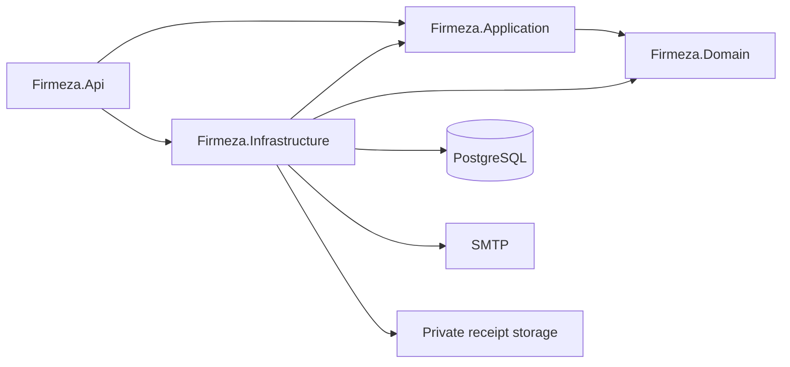
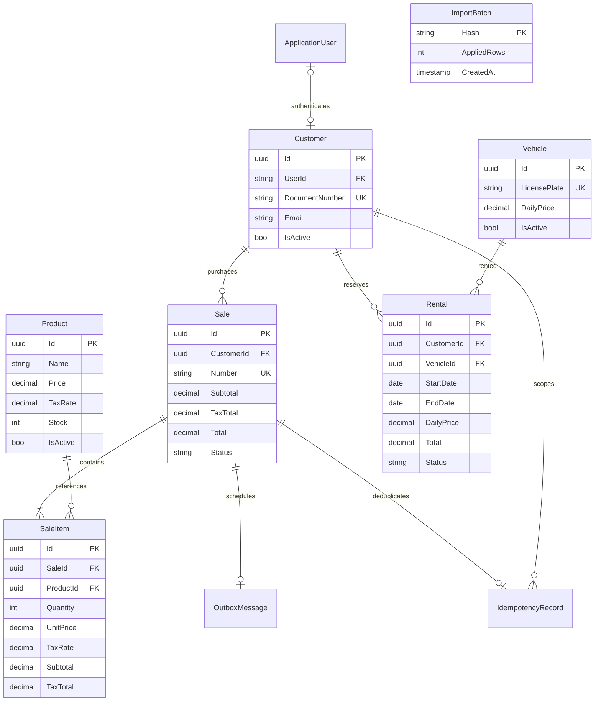
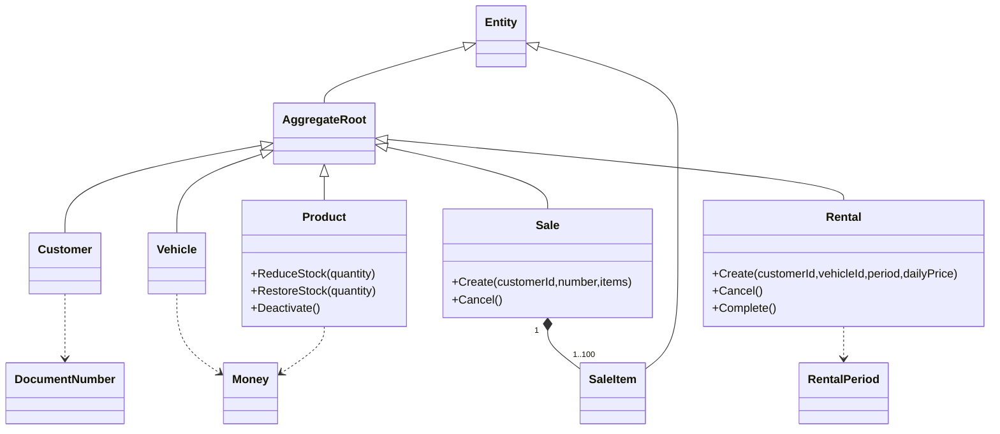

# Architecture and domain model

Business rules live in domain entities. Application services coordinate transactions through interfaces. Infrastructure owns EF Core/Identity, locks, document libraries and external delivery. Controllers expose DTOs and authorization rules. There is no web/persistence dependency in Domain.

Standard Identity users, roles, claims, logins and token tables are managed by Identity migrations. Domain Customer only stores an optional user identifier, not an Identity entity or credentials.

Sale creation acquires a customer-scoped idempotency advisory lock, locks/revalidates the customer, and locks products in UUID order. PostgreSQL row locks serialize competing stock writes. Stored item prices/tax rates do not change when catalogue prices change. Cancellation locks the sale and restores inventory only after a valid transition.

Rental creation locks/revalidates the customer and locks the vehicle before checking reserved date overlaps. Dates are calendar dates with an exclusive end; auditing instants are UTC. Availability is derived from reservations. Explicit row refresh prevents EF's tracking cache from reusing stale unchanged data after a concurrent update.

Imports use a workbook fingerprint lock plus a persisted ImportBatch. Normalization happens before writes, then the whole batch is transactional. Existing sale keys in changed workbooks are rejected before inventory changes. Files are never treated as arbitrary executable spreadsheet logic.

Receipt generation and SMTP delivery are processed from a persisted outbox. Claims use `FOR UPDATE SKIP LOCKED` and an expiring lease; completion updates only the owning lease. At most five attempts are allowed. Receipt files are served only after sale ownership checks.
